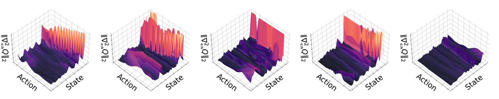
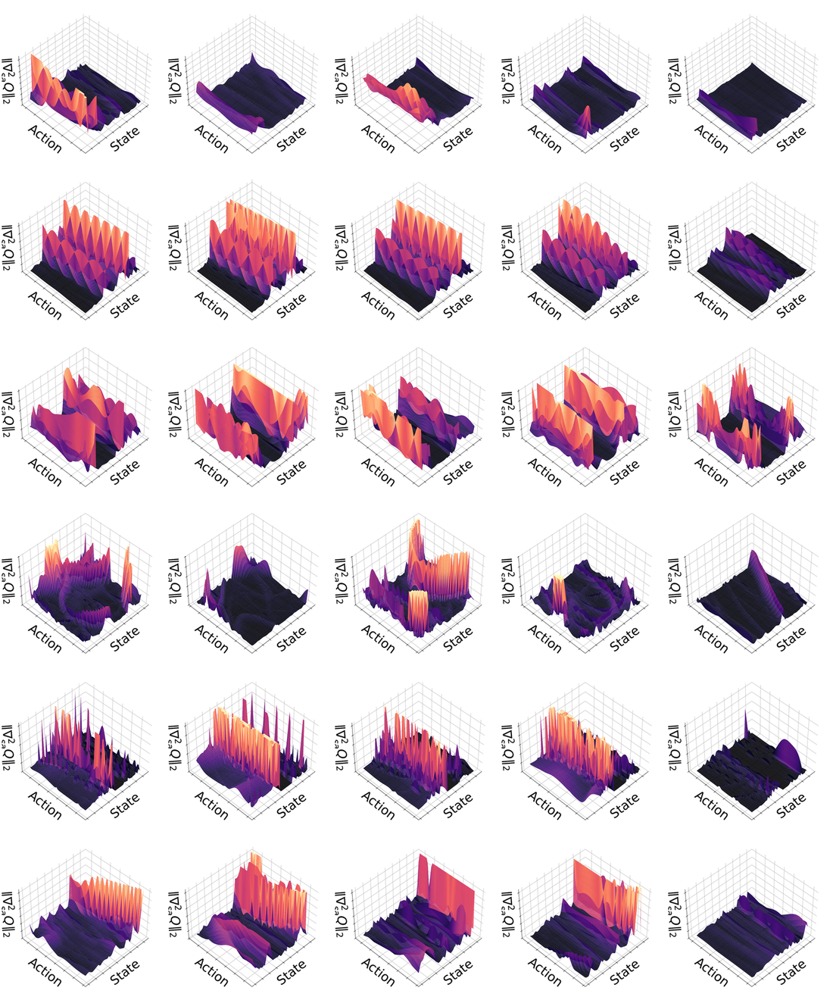
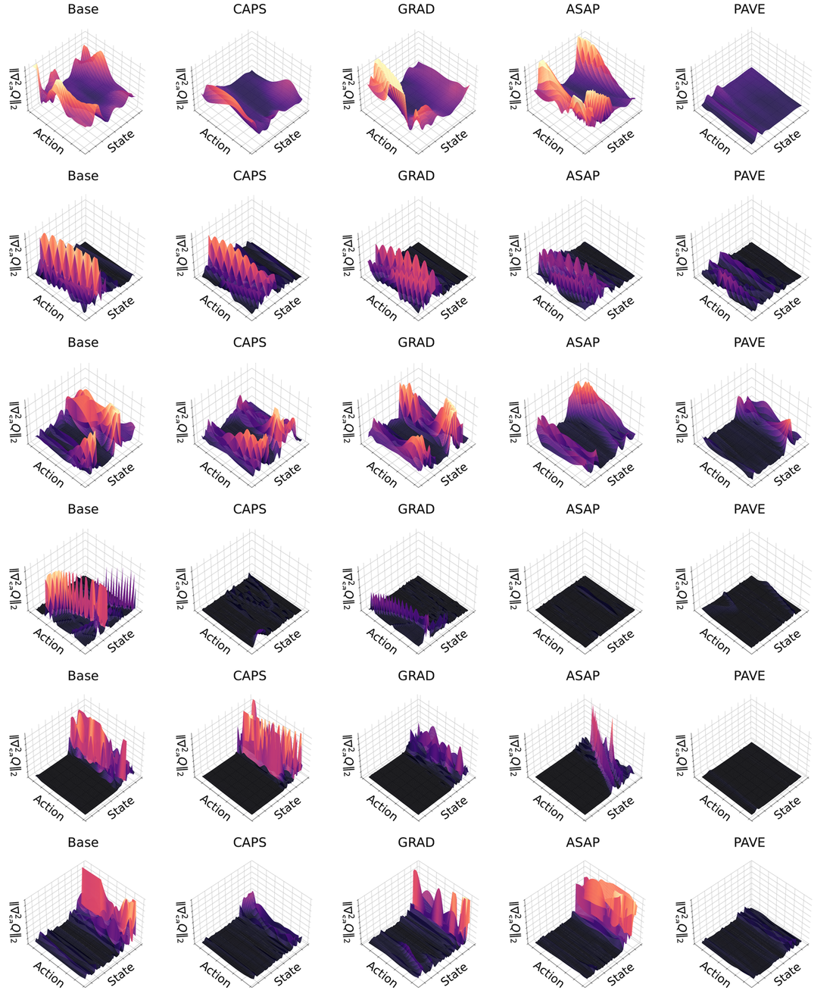

# [ICML 2026 Spotlight] PAVE: Stabilizing the Q-Gradient Field for Policy Smoothness in Actor-Critic Methods

Official implementation of **PAVE (Policy-Aware Value-field Equalization)**, a critic-centric regularization framework that stabilizes the action-gradient field induced by the Q-function. PAVE is built on top of TD3 and SAC and improves policy smoothness without modifying the actor.

> **Stabilizing the Q-Gradient Field for Policy Smoothness in Actor-Critic Methods.**
> Jeong Woon Lee\*, Kyoleen Kwak\*, Daeho Kim\*, Hyoseok Hwang.
> *International Conference on Machine Learning (ICML), 2026 — Spotlight.*

🌐 **Project page**: <https://airlabkhu.github.io/PAVE/>
📄 **arXiv**: <https://arxiv.org/abs/2601.22970>

---

## Overview

Continuous actor–critic policies often produce erratic, high-frequency actions that prevent physical deployment. Existing remedies — CAPS, GRAD, ASAP, L2C2, LipsNet — all attach **policy-side** regularizers to the actor: they smooth the actor's output, but leave the underlying critic landscape untouched. PAVE asks a sharper question:

> *If the actor is just doing gradient ascent on `Q`, where does its non-smoothness actually come from?*

The answer turns out to be a precise statement about the **differential geometry of the critic**.

### Theoretical Result

Let `Q : S × A → R` be a `C²` critic and let `a*(s) = argmax_a Q(s, a)` denote the implicit greedy policy that any actor-critic algorithm targets. Assume that `a*(s)` is an interior strict local maximum, so that `∇²_aa Q(s, a*(s))` is negative definite. Then by the Implicit Function Theorem,

```
∇_a Q(s, a*(s)) = 0   ⇒   ∇_s a*(s) = − [∇²_aa Q(s, a*(s))]⁻¹ · ∇²_sa Q(s, a*(s))
```

Taking spectral norms and pushing through the operator-norm inequality `‖A B‖ ≤ ‖A‖ ‖B‖` yields the central bound of the paper (Prop. 4.2):

```
L  ≜  ‖∇_s a*(s)‖₂   ≤   M / μ
```

with two purely critic-side quantities

| Symbol | Meaning | What it controls |
|--------|---------|------------------|
| `M = ‖∇²_sa Q‖₂` | mixed-partial volatility | how the gradient signal **rotates** with state |
| `μ = |λ_max(∇²_aa Q)|` | strict action-curvature | how **distinct** the optimal action is from neighbours |

A small `M` says "neighbouring states give consistent action gradients"; a large `μ` says "the optimum is sharp, not a plateau". Policy non-smoothness is therefore a property of the critic *before* any actor exists. Smoothing the actor is treating a symptom; PAVE treats the cause.

### Method

PAVE adds three lightweight, Hessian-free auxiliary losses to the critic that directly target this bound:

| Loss | Geometric target | Estimator |
|------|------------------|-----------|
| **`L_MPR`** (Mixed-Partial Regularization) | Suppress `M` isotropically by penalising `‖∇_a Q(s+ε, a) − ∇_a Q(s, a)‖²`. By a 1st-order Taylor expansion this approximates `σ² · ‖∇²_sa Q‖²_F`. | Finite-difference Taylor proxy with `ε ~ N(0, σ²I)` |
| **`L_VFC`** (Vector Field Consistency) | Suppress `M` along the directions the system actually visits, `Δs = s_{t+1} − s_t`. Approximates `‖∇²_sa Q · Δs‖²`. | Finite-difference along consecutive transitions |
| **`L_Curv`** (Curvature Preservation) | Lower-bound `μ` so the inverse Hessian in the IFT formula does not blow up. Penalises `max(0, vᵀ ∇²_aa Q v + δ)`. | Hutchinson trace estimator with Rademacher `v` |

Total objective (added on top of the standard TD loss):

```
L_total  =  L_TD  +  λ₁ L_MPR  +  λ₂ L_VFC  +  λ₃ L_Curv
```

Two design notes:
* **The actor is untouched.** PAVE only modifies the critic update; both TD3 and SAC actors stay standard.
* **`L_Curv` is necessary, not optional.** Suppressing `M` alone (MPR + VFC) drives the critic toward a flat plane, sending `μ → 0` and *worsening* policy smoothness via the inverse Hessian. The factorial ablation in the appendix shows MPR + VFC alone gives `sm = 2.10 > 1.83` (Base) on Walker; adding `L_Curv` recovers `sm = 1.48`.

### What "PAVing" the Q-gradient field looks like

The mixed-partial Hessian norm `‖∇²_sa Q‖₂` is the local volatility of the action-gradient field; it is exactly the `M` that the bound `L ≤ M/μ` minimises. Below we visualise it as a 3-D surface over a 50×50 sweep of the (most-active state dim, most-active action dim) for a trained Walker2d-v5 critic (TD3, SiLU-unified):



*Left → right: Base, CAPS, GRAD, ASAP, PAVE. All five share the same color scale (Z-axis clipped at the Base 99-th percentile) so heights are directly comparable. Baselines exhibit "jagged" landscapes with sharp spikes — this is the same `‖∇²_sa Q‖` that controls policy non-smoothness. PAVE flattens these spikes into a stable, paved manifold.*

The full TD3 sweep (6 environments × 5 methods, same protocol) and the SAC counterpart are below.

---

## Q-Gradient Field Visualisations

These figures are the empirical analogue of the theoretical bound `L ≤ M/μ`. Each panel is a 3-D surface plot of the spectral norm of the mixed Hessian, computed *exactly* via autograd on the trained critic; the visualisation is independent of the policy used during training.

### TD3 (SiLU-unified)



### SAC (SiLU-unified)



*Rows (top → bottom): LunarLander, Pendulum, Reacher, Ant, Hopper, Walker.
Columns (left → right): Base/Vanilla, CAPS, GRAD, ASAP, PAVE.*

### How the figures are computed

1. **Pick the dominant axis (once per environment, from Base).** For each environment, scan all `(state_dim_i, action_dim_j)` pairs *on the trained Base critic* and pick the pair that maximises `|∂²Q / (∂s_i ∂a_j)|` over a sample batch. This identifies the (state, action) coordinate where the Base critic is most volatile. **The same `(s_i, a_j)` pair is then re-used for every method (Base, CAPS, GRAD, ASAP, PAVE)** so that all five panels in a row share the *same* axes — no method gets to pick its own favourable slice. The comparison therefore happens on the region the (unregularised) Base model itself flagged as the worst case.
2. **Sweep on a 50 × 50 grid.** Centred at a reference `(s, a)`, sweep the chosen state dim over `[−1.0, 1.0]` and the chosen action dim over `[−1.5, 1.5]`. The other dimensions are held at the reference value.
3. **Compute the *full* mixed Hessian per grid point.** For each action dim `a_i`, take `∂Q/∂a_i` then differentiate it w.r.t. the entire state vector via autograd (`create_graph=True`), giving one row of `∇²_sa Q ∈ R^{d_a × d_s}`. Stack rows to assemble the full mixed Hessian.
4. **Reduce to a scalar.** Take its spectral norm `‖∇²_sa Q‖₂` (largest singular value via SVD). This is the `M` in `L ≤ M/μ`.
5. **Render.** Plot the resulting 50 × 50 scalar field as a 3-D surface. The Z-axis is clipped at the Base model's 99-th percentile so all five methods are on the same scale and can be compared visually.

The visualisation script lives in `td3/tests/viz_hessian_autograd.py` (and the SAC analogue). All numbers are exact — no Hutchinson, no random projection — so what you see is the actual critic geometry the policy is climbing.

### What the figures mean

* **Height = local policy sensitivity.** A peak in the Base / CAPS / GRAD / ASAP plots marks an `(s, a)` where a small state perturbation can rotate the action gradient sharply. By the bound `L ≤ M/μ`, this directly upper-bounds how non-smooth any actor that climbs `∇_a Q` can become.
* **Spikes = unstable learning signal.** Sharp ridges/spikes mean the actor receives contradictory updates at adjacent states — empirically this manifests as the cosine of consecutive `∇_a Q` flipping sign (see `td3/tests/eval_cosine_sim.py`; PAVE drops these flip rates by 2 – 11×).
* **PAVE flattens consistently across environments.** PAVE's column has the lowest, smoothest surface in 5/6 environments under both TD3 and SAC, matching the quantitative `M_sup` reduction in the paper (e.g. Walker 1923 → 643, Hopper 8831 → 934, Lunar 990 → 151).
* **Policy-side regularisers do *not* fix the critic.** The CAPS/GRAD/ASAP columns are visually similar to Base — they smooth what the actor outputs but leave the critic's geometry essentially unchanged. This is the central empirical observation that motivates the critic-centric perspective.

---

## Repository Layout

```
PAVE/
├── td3/                       Twin Delayed DDPG variants
│   ├── models/                base_td3, caps_td3, grad_td3, asap_td3, pave_td3, *_lips_td3
│   └── tests/                 train / eval scripts, helpers, hyperparameter configs
│       ├── modules/           controller, action_extractor, q_extractor, q_extractor2,
│       │                      q_concavity, params, envs
│       ├── test_all.py        TD3 training entry point
│       ├── eval_concavity.py  exact-trace concavity satisfaction
│       ├── eval_q_supinf.py   trajectory-wise sup ‖∇²_sa Q‖₂ and inf |tr ∇²_aa Q|
│       ├── eval_cosine_sim.py cosine similarity of ∇_a Q across timesteps
│       ├── eval_wallclock.py  wall-clock convergence from TB logs
│       └── viz_hessian_autograd.py
│                              the script that produced the figures above
├── sac/                       Soft Actor-Critic variants (vanilla/caps/grad/asap/pave + lipsnet)
├── figures/                   Q-gradient field PNGs shown in this README
└── README.md
```

Heavy artefacts (pretrained weights, TensorBoard logs, evaluation CSVs, paper LaTeX figures) are intentionally **not** included. Recipes to reproduce them are below.

---

## Setup

### Requirements
- Python 3.10
- PyTorch ≥ 2.1
- Stable-Baselines3 == 2.5.0
- Gymnasium with MuJoCo (`gymnasium[mujoco]`)
- Standard scientific stack (NumPy, SciPy, pandas)

### Install
```bash
conda create -n pave python=3.10
conda activate pave
pip install torch torchvision
pip install "stable-baselines3==2.5.0" "gymnasium[mujoco]"
pip install numpy scipy pandas matplotlib tqdm tensorboard
```

> **Activation note.** PAVE uses **SiLU** activations in the critic to ensure C²-continuity, which is required by the Hutchinson trace estimator in `L_Curv`. All baselines in the paper are also re-trained with SiLU for fair comparison ("SiLU-unified" setting).

---

## Training

### TD3
```bash
cd td3/tests
# Train PAVE on a single environment
python test_all.py --env ant    --algo pave_td3

# Train baselines under the same setting
python test_all.py --env walker --algo base_td3
python test_all.py --env walker --algo caps_td3
python test_all.py --env walker --algo grad_td3
python test_all.py --env walker --algo asap_td3
```

### SAC
```bash
cd sac/tests
python test_all.py --env ant --algo pave_sac
```

### Hyperparameters

PAVE weights `(λ₁, λ₂, λ₃)` follow a coordinate-search policy starting from
`(0.1, 0.1, 0.01)`, swept in the order `λ₃ → λ₂ → λ₁` (most → least sensitive,
which mirrors the role of `μ` in the bound `L ≤ M/μ`). Per-environment values
are hard-coded in `td3/tests/modules/params.py` and `sac/tests/modules/params.py`,
and are listed in Tables 7–8 of the paper. The perturbation scale `σ = 0.01`
and curvature floor `δ = 1.0` are fixed across all environments.

---

## Evaluation

All evaluation scripts produce CSVs (`re`, `sm`, `M_sup`, etc.) and operate on
trained checkpoints. Replace `<pths_root>` with your local results directory.

```bash
cd td3/tests

# Cumulative return + smoothness score (Tables 1, 2)
python evals.py --pths_root <pths_root> --env walker --algo pave_td3

# Concavity satisfaction rate (fraction of states where ∇²_aa Q is strictly NDef)
python eval_concavity.py --pths_root <pths_root> --env walker --algo pave_td3

# sup ‖∇²_sa Q‖₂ and Neg-Def rate (the M and the strict-NDef indicator)
python eval_q_supinf.py --pths_root <pths_root> --env walker --algo pave_td3

# Cosine similarity of ∇_a Q across consecutive timesteps
python eval_cosine_sim.py --pths_root <pths_root> --env walker --algo pave_td3

# Wall-clock convergence time
python eval_wallclock.py --tb_root <tb_root>
```

The smoothness score `sm` is the spectral metric of
[Mysore et al. (2021)](https://arxiv.org/abs/2012.06644) /
[Christmann et al. (2024)](https://arxiv.org/abs/2406.18002), implemented in
`tests/modules/extract.py`.

---

## Reproducing the Paper

Each (env × method) cell is run for multiple independent runs and the
results are aggregated as reported in the paper. The full SiLU-unified
TD3 / SAC tables are reproduced by sweeping the (env × method) grid:

```bash
for env in lunar pendulum reacher ant hopper walker; do
  for algo in base_td3 caps_td3 grad_td3 asap_td3 pave_td3; do
    python td3/tests/test_all.py --env $env --algo $algo
  done
done
```

Sensitivity, ablation, and LipsNet variants follow analogous loops; see
`td3/tests/test_*_param.py` and `sac/tests/test_*_param.py` for the
parameterised training entry points used to produce the appendix experiments.

---

## Acknowledgements

This repository is built on top of the
[**ASAP**](https://github.com/AIRLABkhu/ASAP) codebase (AAAI 2026), which
provided the TD3 / SAC training and evaluation infrastructure that PAVE
extends. We thank the ASAP authors for releasing a clean, well-organised
research code base — many of the shared modules under
`*/tests/modules/` (`controller`, `action_extractor`, `q_extractor`,
`params`, `envs`, etc.) and the smoothness-score (`sm`) evaluation
pipeline originate from that work, and PAVE is implemented as additional
critic-side losses on top of it.

If you use this code, please consider also citing ASAP:

```bibtex
@inproceedings{kwak2026enhancingcontrolpolicysmoothness,
  title     = {Enhancing Control Policy Smoothness by Aligning Actions with Predictions from Preceding States},
  author    = {Kwak, Kyoleen and Hwang, Hyoseok},
  booktitle = {Proceedings of the AAAI Conference on Artificial Intelligence},
  year      = {2026}
}
```

---

## Citation

```bibtex
@inproceedings{lee2026pave,
  title     = {Stabilizing the Q-Gradient Field for Policy Smoothness in Actor-Critic Methods},
  author    = {Lee, Jeong Woon and Kwak, Kyoleen and Kim, Daeho and Hwang, Hyoseok},
  booktitle = {Proceedings of the 43rd International Conference on Machine Learning (ICML)},
  year      = {2026}
}
```

---

## License

Released under the terms in [LICENSE](LICENSE).
